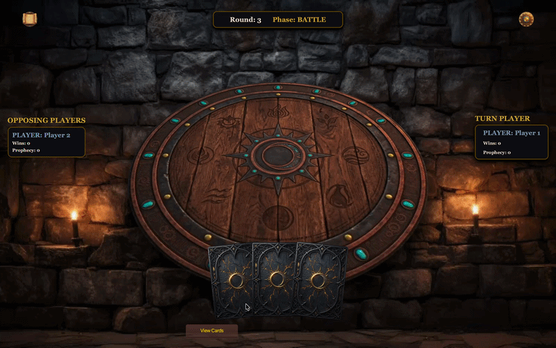

<div align="center">
  
  # 🌑 Clans of the Eclipse
  
  **A strategic trick-taking card game built with Java and JavaFX, featuring dynamic unit hierarchies and deep state synchronization.**
  
  [](https://www.oracle.com/java/)
  [](https://openjfx.io/)
  [](https://maven.apache.org/)
  [](#)

  <br />
  

</div>

---

## 🎯 Project Overview
"Clans of the Eclipse" is a highly tactical trick-taking card game. Victory relies not just on dominating battles through raw power, but on executing precise strategies to fulfill a declared "Prophecy" of exact wins. The project is built on a robust Object-Oriented architecture, ensuring high performance, strict separation of concerns, and a memory-efficient graphical user interface.

---

## ⚙️ Technical Highlights & Architecture

### 1. Architecture & State Synchronization 
* **Strict MVC Enforcement:** The architecture strictly separates the immutable game logic (`GameController`), the mutable data state (`GameStatus`), and the graphical interface (`GameArenaScene`).
* **Unidirectional Data Flow:** The UI dynamically renders based purely on the `GameStatus` object acting as the Single Source of Truth. This completely eliminates stale UI-bound objects and ensures perfect synchronization between the engine and the display during complex phase transitions.

### 2. Design Patterns & Scalability
* **Factory Pattern (`UIFactory`):** Centralizes all JavaFX node generation, enforcing DRY principles and maintaining an absolute, consistent visual identity across all cards, panels, and transition banners.
* **Polymorphic Units Hierarchy:** The game's engine processes combat through abstract unit behaviors. Special units (such as *Leviathan* or *Oracle*) encapsulate their own rule-breaking mechanics, allowing the `BattleResolver` to execute logic polymorphically without nested `if-else` chains.

### 3. Resource & Memory Management
* **Optimized Image Caching:** The `ImageCache` utility guarantees that heavy graphical assets are loaded from the disk only once, preventing memory leaks and frame drops during rapid UI updates and complex card-throw animations.

---

## 👥 The Team & Contributions (Team Shrimp-Pasta)

| Team Member | Contributions & Associated Modules |
| :--- | :--- |
| **Khaled Khalifa** | Core Unit Polymorphism, `EffectResolver`, GUI Engine (`GameArenaScene`, `CardNode`, `UIFactory`, `ProphecySelector`, `SceneManager`), State Synchronization, and Asset Management. |
| **Mohamed Draz** | Core Game Engine (`RoundManager`, `ScoreManager`, `GameController`) and Enums. |
| **Ali Mostafa** | `BarracksManager`, `BattleResolver`, Exceptions, and `SaveManager` implementation. |
| **Abdelrahman Kandeel** | Base Model structures and Secondary GUI Scenes (`InfoScene`, `SettingsScene`, `StartMenuScene`). |
| **Adel Gomaa** | Command Line Interface logic and feedback scenes (`NamingScene`, `ScoreBoardScene`, `WinnerScene`). |

---

## 🚀 Local Deployment

### Prerequisites
* **JDK:** Version 11 or higher.
* **Build Tool:** Apache Maven.

### Build Instructions
Execute the following commands in your terminal to compile and launch the application:

```bash
# 1. Clone the repository
git clone https://github.com/Khaled-TE/clans-of-the-eclipse-card-game.git

# 2. Navigate to the project directory
cd clans-of-the-eclipse-card-game

# 3. Clean, build, and run via Maven
mvn clean javafx:run